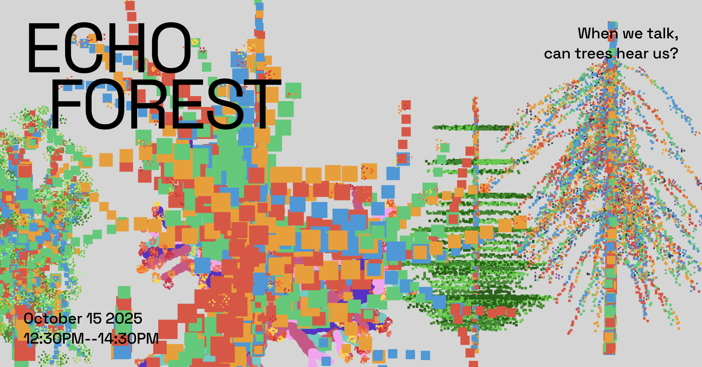

# Echo Forest 🌳


## 实时音频交互式生成艺术

一个支持实时麦克风输入的交互式艺术创作工具，通过声音生成独特的多样化树木艺术。

## 🎨 多风格艺术展示

Echo Forest 支持多种艺术渲染风格，每种风格都能创造独特的视觉体验：

### 🌈 艺术风格画廊
- **🔲 像素艺术风格**: 复古像素化效果，充满怀旧氛围
- **📝 字符艺术风格**: 使用文字和符号构建的独特视觉
- **🔢 数字艺术风格**: 数字序列组成的现代抽象美学
- **🧩 马赛克风格**: 色块拼接的艺术马赛克效果
- **🎭 波普艺术风格**: 明亮活泼的波普艺术色彩
- **🎋 中国风格**: 传统水墨画风格的优雅呈现

### ✨ 核心功能

- 🎵 **实时音频响应**: 支持麦克风输入，实时波形显示和树木生成
- � **多样化树木**: 5种逼真树型（柳树、枫树、松树、橡树、樱花树）
- 🎨 **6种艺术风格**: 点阵、字符、数字、马赛克、波普、中国风
- � **风效果动画**: 自然的风吹摆动，树木随风摇曳
- 🖱️ **拖拽移动**: 可以自由拖动树木重新排列森林布局
- 🌍 **统一地平线**: 所有树木在同一水平线上生长，形成真实森林效果
- 🚫 **防重叠系统**: 智能位置分配，确保树木不会重叠
- 📊 **实时波形**: 左侧显示音频波形和特征数据
- 💾 **高质量导出**: 保存为矢量图形和动态GIF
- 🔧 **性能优化**: 流畅的动画和高效的渲染系统

### 🎮 操作指南

#### 🎵 音频交互
- **🎤 开始录音**: 点击录音按钮开始捕获声音
- **🗣️ 声音输入**: 说话、唱歌、制造声响来驱动树木生长
- **⏹️ 停止录音**: 停止录音时树木立即完成生长
- **📊 实时反馈**: 左侧显示音频波形和特征数据

#### 🌳 森林管理
- **🖱️ 拖拽移动**: 点击并拖动任意树木重新布置森林
- **🎨 切换风格**: 选择不同艺术风格查看效果变化
- **🌈 背景设置**: 自定义背景颜色创造不同氛围
- **🧹 清空森林**: 一键清除所有树木重新开始创作

#### 实时音频功能
- **波形显示**: 左侧实时显示麦克风输入的音频波形
- **音频数据**: 显示当前音量、音调、能量数值
- **响应种树**: 在实时模式下，树木特征完全由当前音频决定
- **动态摇摆**: 成熟的树木会根据音频强度摇摆

#### 🌳 树木类型
程序会循环选择以下5种逼真树木类型：

- 🌿 **柳树 (Willow)**: 优雅下垂的枝条，随风飘逸
- 🍁 **枫树 (Maple)**: 层次丰富的分枝结构，四季变化
- 🌲 **松树 (Pine)**: 挺拔的锥形结构，常青不败  
- 🌳 **橡树 (Oak)**: 茂密宽广的树冠，古朴沧桑
- � **樱花树 (Cherry)**: 精致的花朵效果，浪漫唯美

#### 🌊 动态效果
- **风吹摆动**: 所有树木都会根据风效算法自然摆动
- **音频同步**: 树木会根据当前音频强度调整摆动幅度
- **生长动画**: 每棵树都有独特的生长过程，从无到有逐渐成形
- **尺寸变化**: 每棵树都有不同的尺寸倍数(1.2-2.0倍)，增加层次感

#### 声音描述词汇
输入这些词汇可以生成不同特征的树木：

- 🎶 **音调**: `高音`、`低音` - 影响树的分枝角度
- 🔊 **音量**: `大声`、`轻柔` - 影响树的高度和粗细  
- 🎵 **风格**: `节奏`、`旋律` - 影响树的分枝数量
- 🎼 **情感**: `和谐`、`激烈` - 影响树的整体形态

你也可以输入任意文字，程序会根据文字特征生成相应的树木！

### 🚀 运行方法

#### 🌟 推荐版本（Multi-Style）
```bash
# 运行最新的多风格版本
python3 echo_garden_multi_style.py
```

#### 🎨 其他版本
```bash
# 基础版本
python3 echo_garden.py

# 实时音频版本  
python3 echo_garden_realtime.py

# 高级UI版本
python3 echo_garden_premium.py
```

#### 📦 依赖安装（可选）
```bash
# macOS/Linux 安装音频支持:
bash install_audio.sh

# Windows 安装音频支持:
# 双击运行 install_audio_windows.bat
```

**💡 提示**: 即使没有安装PyAudio，程序也会正常运行，使用模拟音频模式。

### 🎨 创作提示

1. **实验不同词汇组合**: 试试 "激烈的高音" 或 "轻柔的旋律"
2. **观察成长动画**: 每棵树都有独特的生长过程
3. **尝试不同主题**: 同样的声音在不同主题下会呈现不同效果
4. **保存你的作品**: 创作满意时记得保存为EPS文件

### 🌟 艺术理念

Echo Garden 将声音的抽象特质转化为视觉的树木形态，每一次输入都是独特的创作过程。通过文字描述声音，我们架起了听觉与视觉之间的桥梁，让每个人都能创造属于自己的声音花园。

> **"When we talk, can trees hear us?"** 
> 
> 这是一个关于声音与自然对话的数字艺术实验。每一个声音都能在这个虚拟花园中生长出独特的树木，创造一片属于你的声音森林。
### � 技术特点

#### 🏗️ 核心架构
- **Python 3.13**: 使用最新Python版本开发
- **Tkinter GUI**: 跨平台图形界面框架
- **PyAudio**: 实时音频处理（可选依赖）
- **模块化设计**: 清晰的类结构和组件分离

#### 🎨 渲染系统
- **多风格渲染器**: 6种不同艺术风格的独立渲染引擎
- **智能缓存**: 性能优化的绘制缓存机制
- **动态更新**: 只在必要时重绘，减少CPU占用
- **矢量图形**: 支持EPS格式的高质量导出

#### 🎵 音频处理
- **实时捕获**: 麦克风音频实时采样和处理
- **5维特征**: 音量、能量、频率、变化率、和谐度分析
- **智能映射**: 音频特征到树木属性的自然映射
- **缓冲管理**: 防止内存泄漏的智能缓冲区管理

#### 🌳 树木系统
- **物理模拟**: 基于正弦波的风效果算法
- **防重叠**: 智能位置分配和碰撞检测
- **拖拽系统**: 流畅的鼠标交互和位置更新
- **类型循环**: 5种树木类型的循环分配机制

---

**开始创作你的声音花园吧！** 🎶🌿✨
